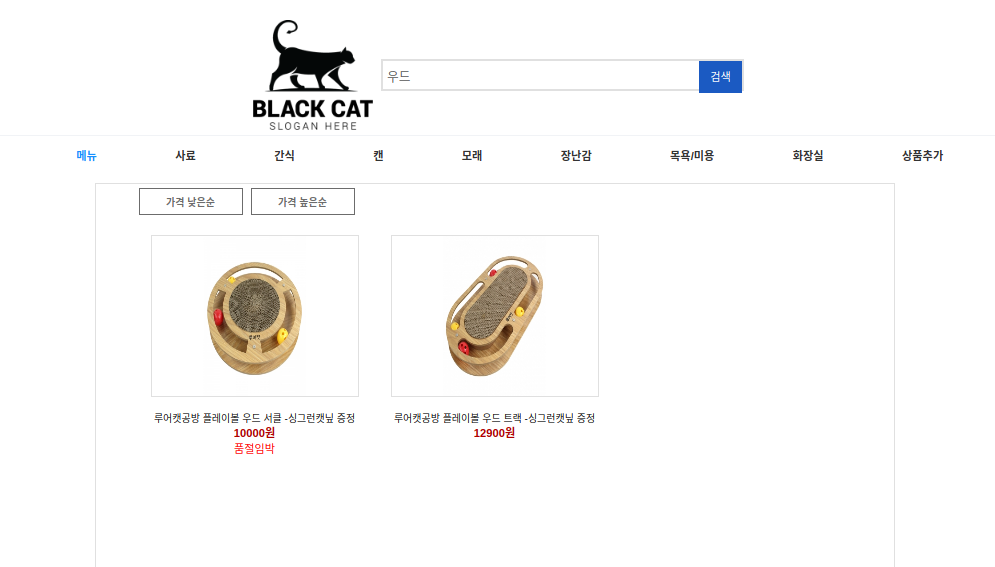
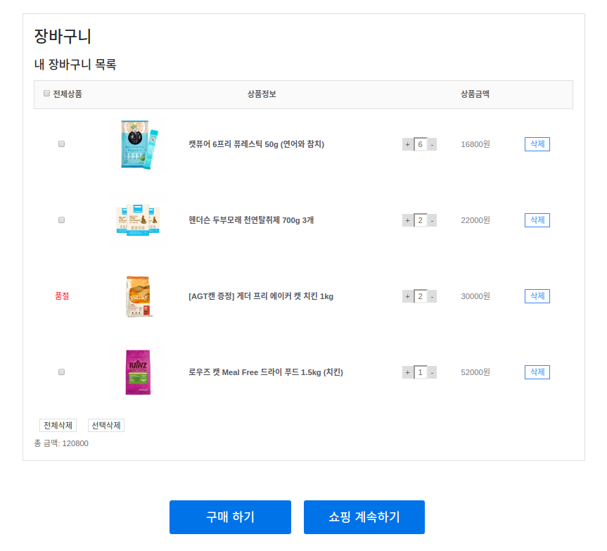
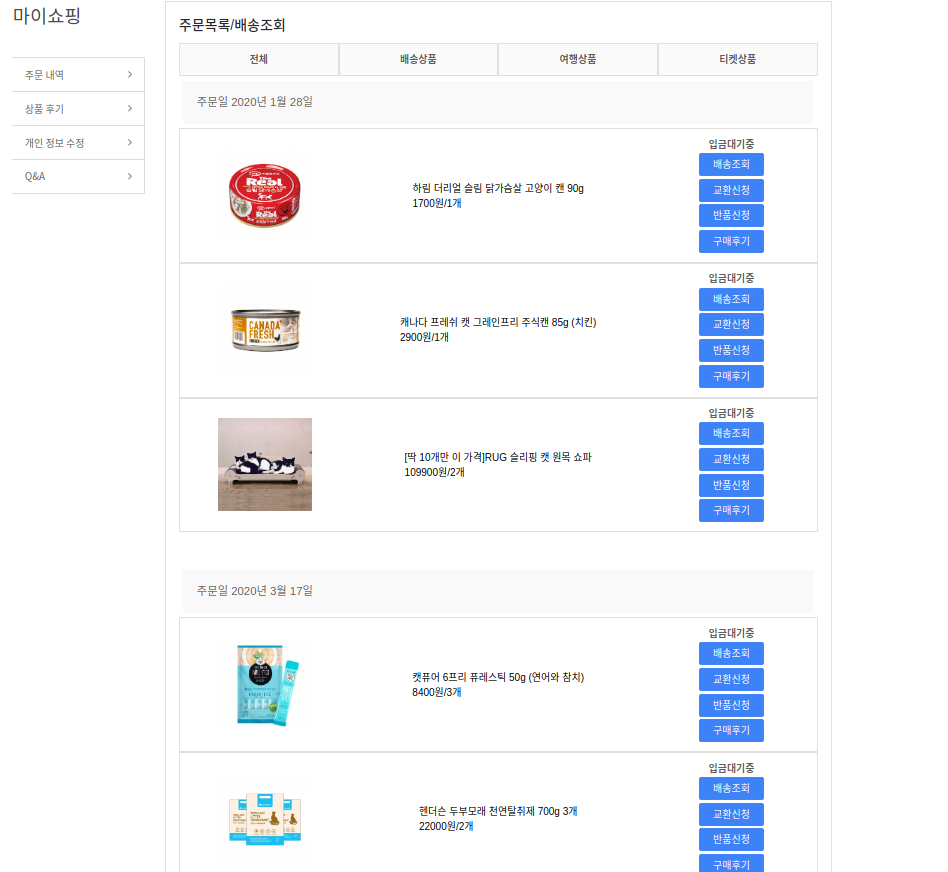
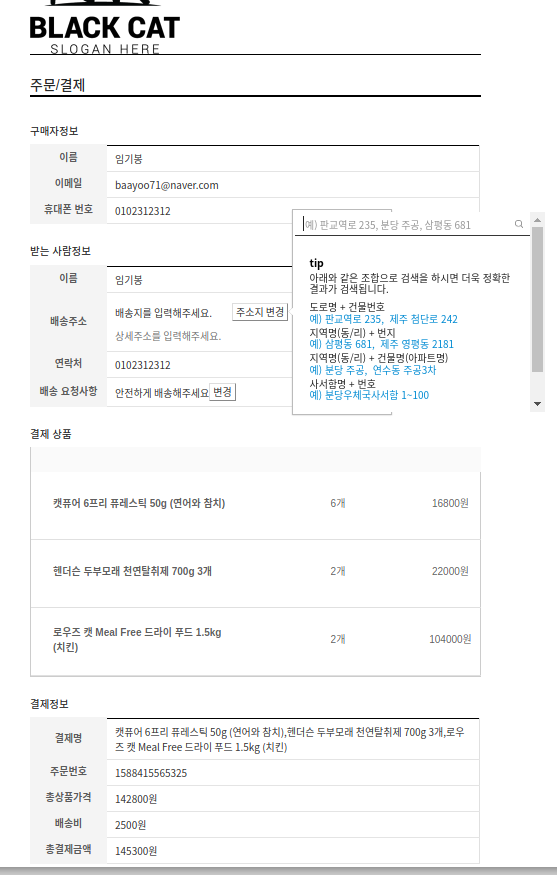
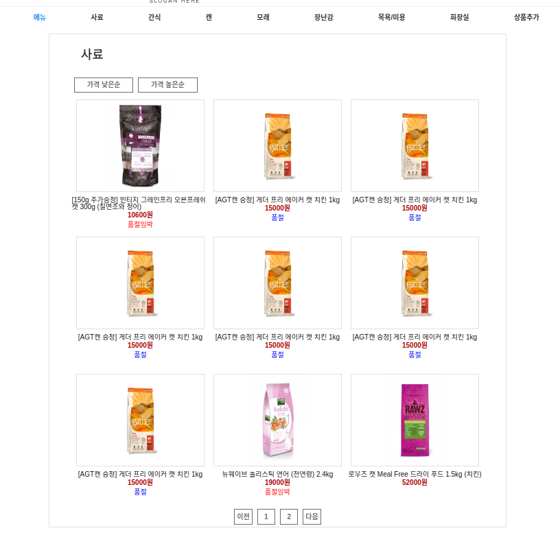
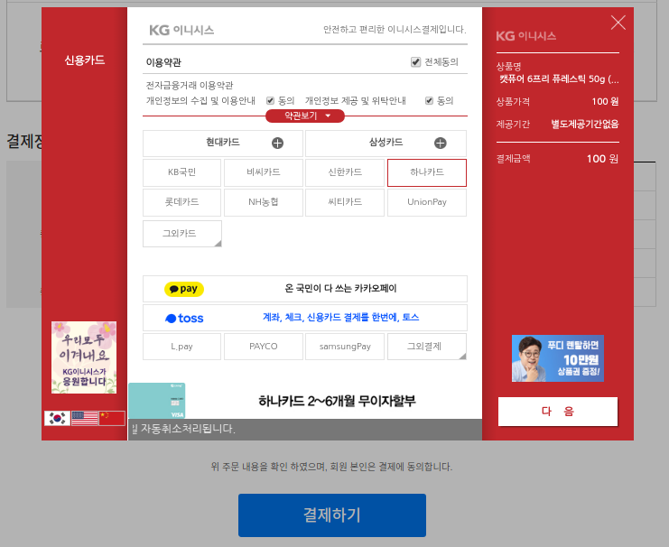
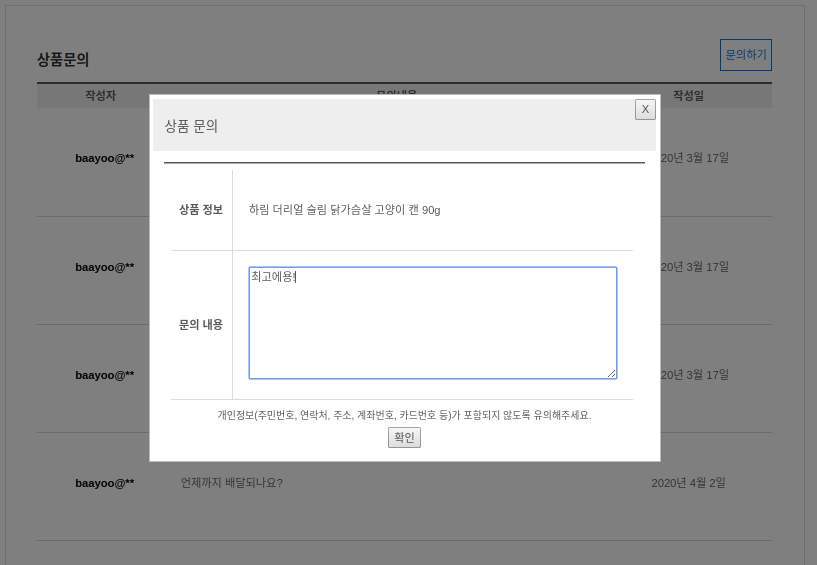
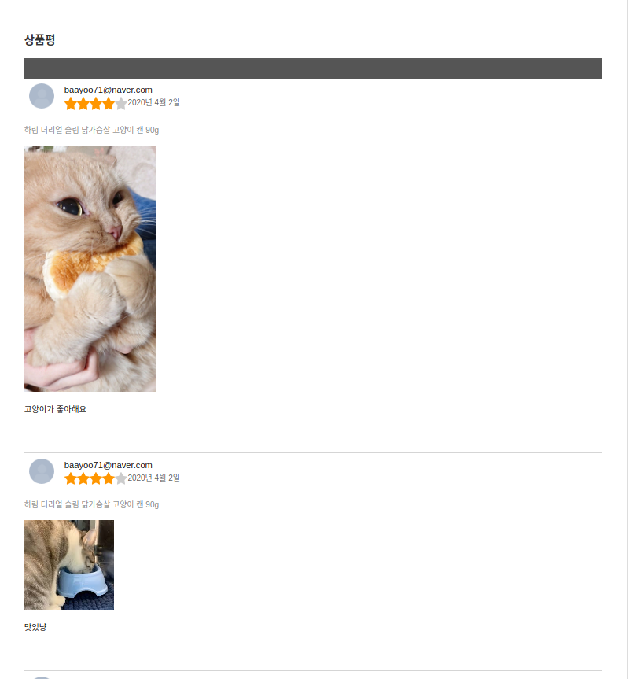
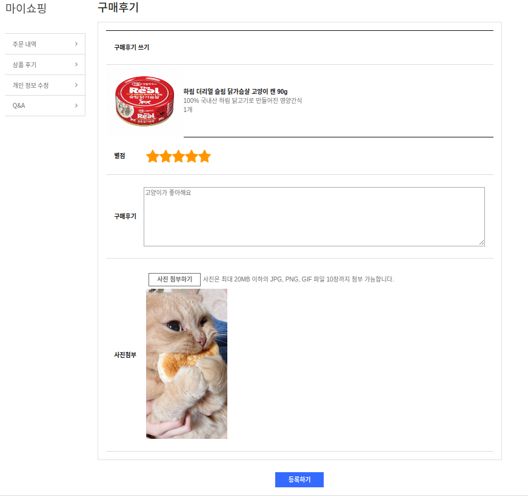

# catWeb

리액트 라이브러리를 사용한 쇼핑몰 프로젝트*

## 프로젝트 소개

2020.11.21~2020.03.20

## 웹 사이트 화면

## 구현한 기능

- 로그인/로그아웃/회원가입
- 장바구니담기, 삭제, 구매
- 상품나열, 재고, 페이지네이션
- 상품디테일페이지
- 구매 목록, 상품후기, 개인정보 수정
- 상품 검색
- 리뷰평점, 사진첨부
- 리뷰리스트
- 상품문의
- 주문정보 페이지
- 결제기능

## 사용 기술

|FrontEnd||
|---|---|
|Language|JavaScript|
|FrontEnd|React, Webpack,Axios|
|BackEnd|Nodejs-Express|
|DataBase|MongoDB, Redis|
|DevOps|Docker|
|Infra|AWS EC2, AWS S3, Atlas|

|                 메인                |               검색기능                |
| :-----------------------------------: | :-----------------------------------: |
|     |    |

|               장바구니                |                상품디테일               |
| :-----------------------------------: | :-----------------------------------: |
|  |   |

|                구매페이지               |               결제페이지             |
| :-----------------------------------: | :-----------------------------------: |
|  |  |

|               상품 목록               |                 결제기능                |
| :-----------------------------------: | :-----------------------------------: |
|  |  |

|               문의기능               |                 리뷰목록                |
| :-----------------------------------: | :-----------------------------------: |
|  |  |
|

|                           리뷰기능                        |
| :------------------------------------------------------: | 
|  |